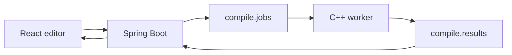

# Mark language (MVP)

Mark is a Typst-like document language that compiles to HTML.

## Syntax

### Markup

- Headings: `= Title`, `== Section`
- Emphasis: `*strong*`, `_emphasis_`
- Lists: `- item`
- References: `@label` (requires `<label>` on a heading)

### Code

- Functions: `#link("url")[label]`, `#image("path", alt: "text")`
- Tables: `#table(columns: 2, [A], [B], [C], [D])`
- Layout: `#grid(columns: 2)[...]`, `#box[...]`, `#align(center)[...]`
- Styling: `#set text(font-family: "Georgia, serif", font-size: 12pt)`
- Show rules: `#show heading: set block(class: "title")`

## Pipeline



## Local development

```bash
# compiler
./run.sh
./bin/mark examples/hello.mark > out.html

# stack
docker-compose up -d zookeeper kafka
./bin/mark-worker &
java -jar backend/target/backend-0.0.1-SNAPSHOT.jar

# frontend
cd frontend && npm install && npm run dev
```

## Layout

- `compiler/` — C++ lexer, parser, IR, HTML emitter (unity build)
- `worker/` — Kafka consumer that compiles jobs
- `backend/` — Spring Boot REST + Kafka bridge
- `frontend/` — React editor + preview
- `examples/` — sample `.mark` files
- `stdlib/` — reusable themes and templates
