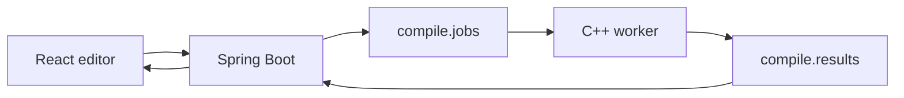

# Mark language (MVP)

Mark is a Typst-like document language that compiles to HTML.

## Syntax

### Markup

- Headings: `= Title`, `== Section`
- Emphasis: `*strong*`, `_emphasis_`
- Lists: `- item`
- References: `@label` (requires `<label>` on a heading)
- Math: `$E = mc^2$` (inline, rendered as styled span)

### Code

- Functions: `#link("url")[label]`, `#image("path", alt: "text")`
- Tables: `#table(columns: 2, [A], [B], [C], [D])` (multiline args supported)
- Layout: `#grid(columns: 2)[...]`, `#box[...]`, `#align(center)[...]`
- Styling: `#set text(font-family: "Georgia, serif", font-size: 12pt)`
- Show rules: `#show heading: set block(class: "title")`
- Heading numbers: `#set heading(numbering: "1.")`
- Modules: `#include "file.mark"`, `#import "file.mark"`
- Context: `#context("title")` resolved from compile job JSON

## Pipeline



## Local development

```bash
just setup   # build compiler, backend, frontend, and agent deps
just dev     # start Kafka, worker, backend, agent, and the editor
just stop    # stop all services
```

## API

- `POST /api/jobs` — `{ "source": "...", "context": { "title": "..." }, "assets": { "path": "assetId" } }`
- `GET /api/jobs/{id}` — poll job status
- `GET /api/jobs/{id}/events` — SSE stream until done/error
- `POST /api/assets` — multipart upload, returns `{ "assetId": "..." }`

## Layout

- `compiler/` — C++ lexer, parser, IR, HTML emitter (unity build)
- `worker/` — Kafka consumer that compiles jobs
- `backend/` — Spring Boot REST + Kafka bridge
- `frontend/` — React editor + preview
- `examples/` — sample `.mark` files
- `stdlib/` — reusable themes and templates
